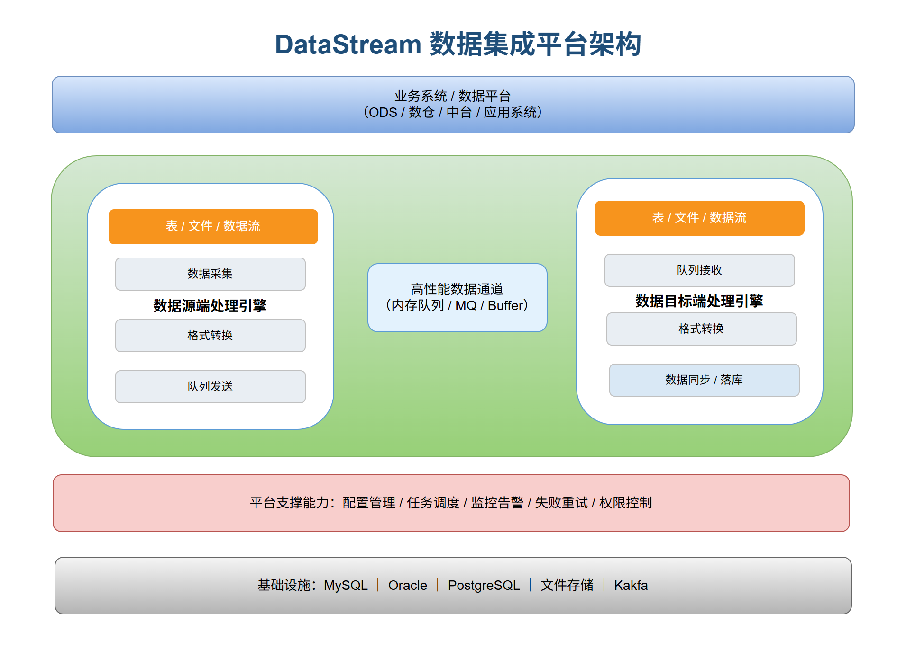
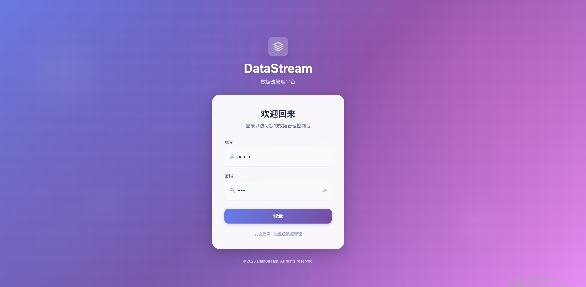
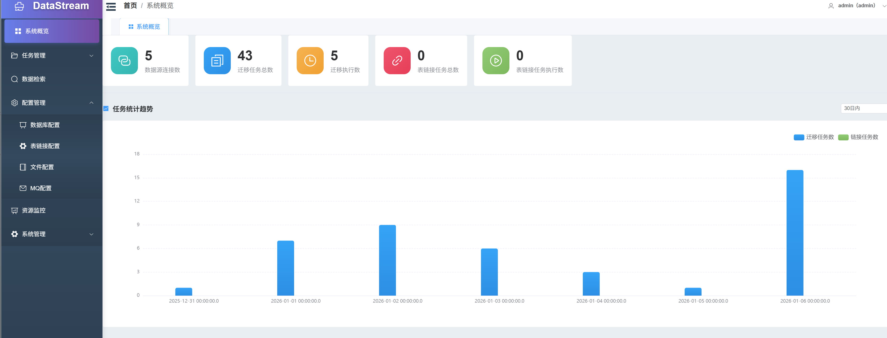
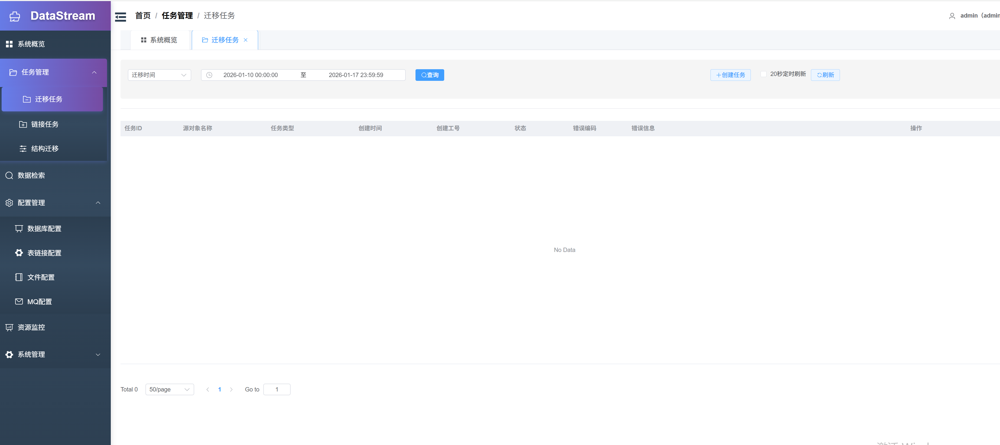
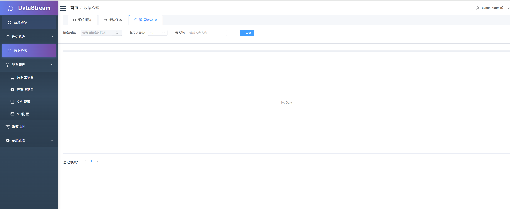
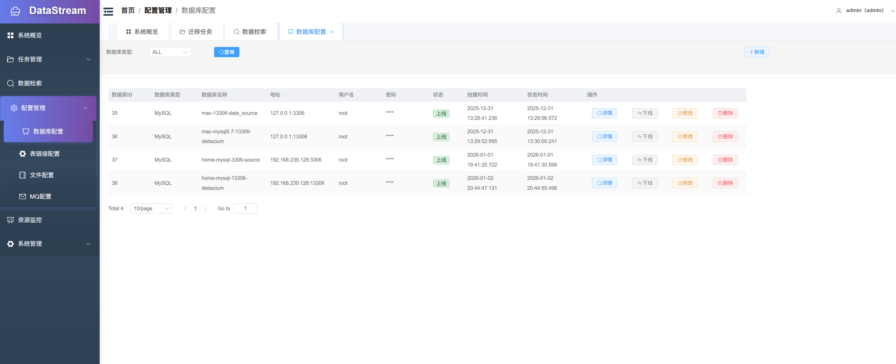
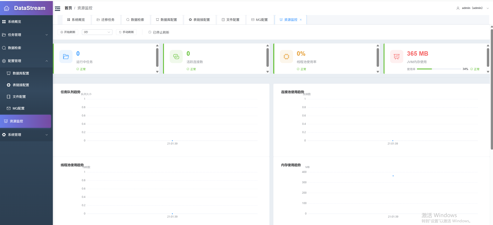

# DataStream 数据工具

[](http://www.apache.org/licenses/LICENSE-2.0)
[](https://www.oracle.com/java/)
[](https://spring.io/projects/spring-boot)
[](https://vuejs.org/)

## 文档索引

项目文档统一归置在 [`doc/`](doc/) 目录，完整索引见 [doc/README.md](doc/README.md)。

## 功能简介

DataStream 是一款功能完善的数据处理平台，提供数据迁移、数据清理、数据稽核、结构迁移、增量迁移、链表迁移、数据检索、配置管理等核心功能。

**核心设计目标**：开发迅速、学习简单、轻量级、易扩展



### 核心功能

| 功能 | 说明 |
|:----:|------|
| **数据迁移** | 支持数据库与文件间的双向数据同步，灵活配置字段映射 |
| **数据清理** | 根据目标端数据状态，反向清理源端已同步的数据 |
| **迁移清理** | 数据同步过程中自动清理源端数据，实现「搬运即清理」 |
| **数据稽核** | 比对源端与目标端数据差异，一键修复不一致数据 |
| **结构迁移** | 跨数据库表结构批量转换，支持同构与异构场景 |
| **增量迁移** | 基于 CDC 技术实现源端数据实时增量同步 |
| **链表迁移** | 多表关联数据批量迁移，自动处理表间关系 |
| **数据检索** | 跨数据源统一查询界面，一站式访问所有数据 |
| **配置管理** | 数据源连接配置、测试验证与统一管理 |

### 技术栈

**后端**
- Spring Boot 2.1.4
- MyBatis + Druid
- JWT 认证
- Debezium (CDC 增量迁移)

**前端**
- Vue 3.3 + Vite 6
- Element Plus
- Pinia + Vue Router 4

**支持的数据源**
- 数据库：MySQL、Oracle、PostgreSQL、H2、Doris、达梦（DM8）
- 文件：Text 文本文件、Excel 文件
- 消息队列：Kafka、RocketMQ、RabbitMQ、ActiveMQ

### 注意事项

- 数据源端和数据目标端可以是数据库表，也可以是数据文件
- 支持二次开发集成新的数据库和文件类型
- 增量迁移（CDC）目前仅支持源端为 MySQL 数据库

---

## 应用场景

### 数据同步场景

- 格式化 TXT 文本数据指定字段导入数据库
- 格式化 Excel 数据指定字段导入数据库
- 数据库表指定字段导出成文本文件
- 数据库表指定字段导出成 Excel 文件
- 不同数据库间表数据互相同步倒换
- 不同文件格式数据互相同步倒换

### 数据比较场景

- 源端 TXT 文件与目标端数据库表数据差异比较，支持以源数据为准修复
- 源端 Excel 文件与目标端数据库表数据差异比较，支持以源数据为准修复
- 源端数据库表与目标端 TXT 文件数据差异比较
- 源端数据库表与目标端 Excel 文件数据差异比较
- 源端数据库表与目标端数据库表数据差异比较，支持以源数据为准修复
- 源端 TXT 文件与目标端 Excel 文件数据差异比较

### 链表迁移场景

- 将某一数据库中指定多表关联数据批量迁移到另外一个数据库
- 应用示例：
  - 将生产库中指定流程数据迁移到测试环境进行流程验证
  - 按业务流程进行数据备份

### 库表转换场景

- 指定一个数据库用户下的表结构迁移至另外一个数据库
- 支持同类型数据库之间转换
- 支持不同数据库之间进行表结构转换

---

## 模块结构

```
datastream/
├── datastream-admin/          # 管理后台（Controller、Service、Handler）
├── datastream-common/         # 公共工具和领域模型
├── datastream-connectors/     # 数据源适配器（连接器模式）
│   ├── connector-mysql/       # MySQL 连接器
│   ├── connector-oracle/      # Oracle 连接器
│   ├── connector-postgres/    # PostgreSQL 连接器
│   ├── connector-dameng/      # 达梦（DM8）连接器
│   ├── connector-h2/          # H2 连接器
│   ├── connector-kafka/       # Kafka 连接器
│   └── connector-file/        # 文件连接器（Text/Excel）
├── datastream-engine/         # 核心数据迁移引擎
├── datastream-security/       # JWT 认证模块
├── datastream-starter/        # Spring Boot 启动入口
├── datastream-ui/             # Vue 3 前端
└── datastream-dist/           # 项目打包模块
```

---

## 安装部署

### 环境要求

**后端**
- JDK >= 1.8（推荐 JDK 1.8）
- Maven >= 3.5

**前端**
- Node >= 16.0.0
- npm >= 8.0.0

### 配置说明

- `application.properties` - DataStream 基本配置
- 元数据库：系统默认内置 H2 作为系统运行元数据库

### 构建运行

**后端构建**

```bash
# 构建整个项目
mvn clean install

# 构建指定模块
mvn clean install -pl datastream-starter

# 打包部署
mvn clean package
```

**前端构建**（在 `datastream-ui/` 目录下）

```bash
cd datastream-ui

# 安装依赖
npm install

# 开发服务器
npm run dev

# 生产构建
npm run build
```

### 应用启动

- Linux：`bin/startup.sh`
- Windows：`bin/startup.cmd`

---

## 操作演示

### 系统登录

- 默认地址：http://localhost:9199/datastream/#/
- 默认账号：admin / admin

> 注意：服务器部署时需将 `127.0.0.1` 替换为服务器 IP 地址

### 界面预览

#### 系统登录


#### 系统概览


#### 任务管理


#### 数据检索


#### 配置管理 - 数据库配置


#### 资源监控


---

## 版本现状

### 已完成功能

- 核心数据处理功能（迁移、稽核、清理等）
- 多数据源支持（数据库、文件、消息队列）
- Web 管理界面
- 基础认证与权限控制

### 持续完善

由于个人精力有限，以下功能正在持续完善中：

- 权限管理模块
- 界面美化与用户体验优化
- 定时任务调度
- 更多数据库类型支持

---

## 沟通交流

### 问题反馈

如果您在使用过程中遇到 Bug 或有功能建议，欢迎在 Issue 中反馈。

### 加入讨论

QQ 群：**795166868**

扫描下方二维码入群讨论（加好友请注明 "datastream交流"）：


---

## 开源协议

本项目采用 [Apache License 2.0](http://www.apache.org/licenses/LICENSE-2.0) 开源协议。
